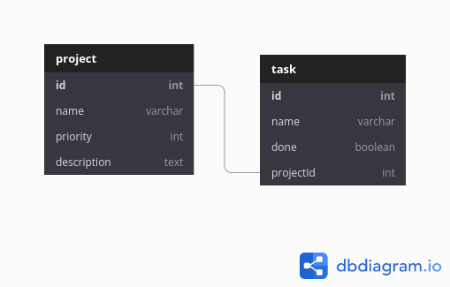

## Nodejs Sequelize RESTAPI PostgreSQL

This is a simple REST API using Javascript Technologies and PostgreSQL.

- nodejs
- express
- postgreSQL
- sequelize

## Modeling

This is the basic relationship that we are using in this example



## Project Structure

```bash
.
├── package.json
├── requests
│   ├── projects.http
│   └── tasks.http
├── sql
│   └── db.sql
└── src
    ├── app.js
    ├── controllers
    │   ├── project.controller.js
    │   └── task.controller.js
    ├── database
    │   └── database.js
    ├── index.js
    ├── models
    │   ├── Project.js
    │   └── Task.js
    └── routes
        ├── projects.routes.js
        └── tasks.routes.js

7 directories, 15 files
```
